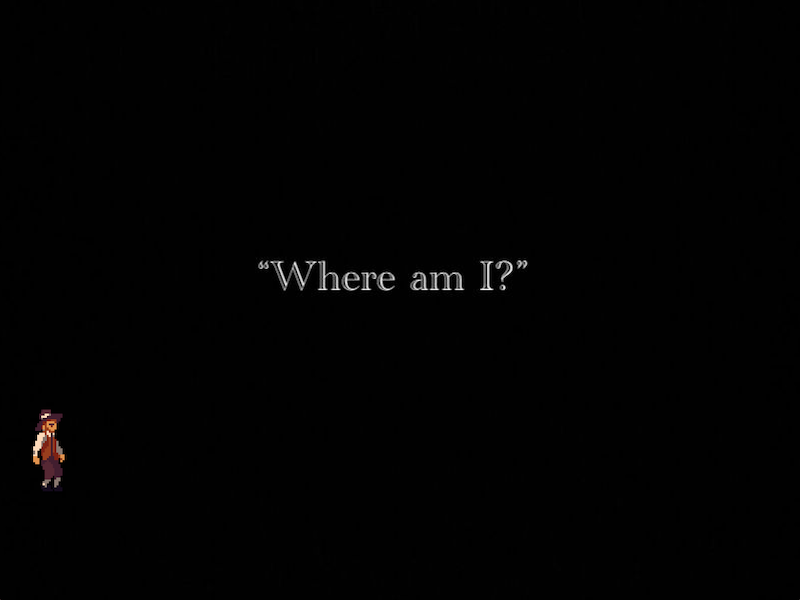
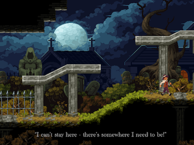
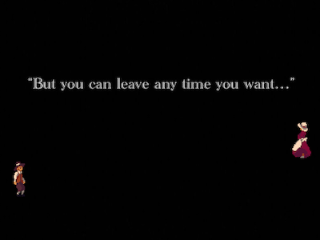
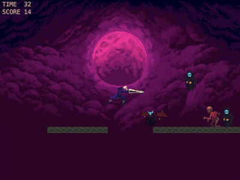
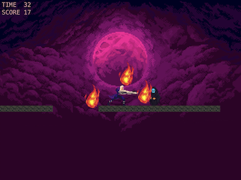
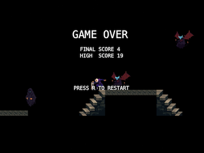

# WhereAmI - 2D Pixel-Art Platformer




**Full Tech Stack:** Java, Swing, JBox2D, JUnit, Mockito, Maven

## Introduction
On an eerily chilly night, you awake in a cemetery. Your attempts to escape are to no avail...

At the height of your desperation, an angel descends from the sky and transforms you into a grey-haired swordsman.

“I won’t help you anymore,” she declares, before vanishing.

Now you’re alone in a nightmarish world swarming with demons. With only your blade and a precious minute to live, how long can you survive?

Fight off demons, dodge traps, and try to survive for 60 seconds in this fast-paced 2D platformer.

---

## Installation

**Supported platforms:**  
- Windows 10 / 11  
- macOS (Intel and Apple Silicon, via a Java 17+ runtime)
 
---

### 1. Install Java 17+

Ensure Java 17 or later is installed and available on your `PATH`.

On Windows or macOS, you can verify with:

```bash
java -version
```

You should see something like:

```text
openjdk version "17.0.x" ...
```

### 2. Download the game

Clone or download this repository:

```bash
git clone https://github.com/maheenmatin/WhereAmI.git
cd WhereAmI
```

You should see `WhereAmI.jar` in this directory.

### 3. Run on Windows

From **Command Prompt**:

```cmd
cd C:\path\to\WhereAmI
java -jar WhereAmI.jar
```

From **PowerShell**:

```powershell
cd "C:\path\to\WhereAmI"
java -jar .\WhereAmI.jar
```

### 4. Run on macOS

From **Terminal**:

```bash
cd /path/to/WhereAmI
java -jar WhereAmI.jar
```
---

## Controls & gameplay

- `A` / `D` – move left / right  
- `W` – jump  
- `S` – attack  
- `C` – advance cutscenes / dialogue  
- `R` – restart after **Game Over**

**Win / lose conditions:**

- The goal is to defeat as many demons as possible in **60 seconds**
- You die if:
  - A demon catches you, or  
  - You fall onto spikes, or  
  - The 60-second timer expires

---

## Screenshots







---

## Proprietary dependency: `CityEngine.jar`

This project was initially built in an academic environment supported by **City St George's, University of London**.

- The source code **relies on a proprietary library** called `CityEngine.jar`.
- `CityEngine.jar` is **intellectual property of City St George's, University of London** and **cannot be redistributed** in a public repository.
- For that reason, the JAR is **not included** here.
- The codebase assumes that `CityEngine.jar` is lawfully obtained and available on the **classpath**.

## Testing

The project includes a test suite using **JUnit** and **Mockito** for:

- Validating core game logic and rule handling (e.g. timer / death conditions)
- Ensuring key services behave correctly under different scenarios

Tests can be run via your IDE or Maven (if you have a compatible environment and dependencies configured):

```bash
mvn test
```
