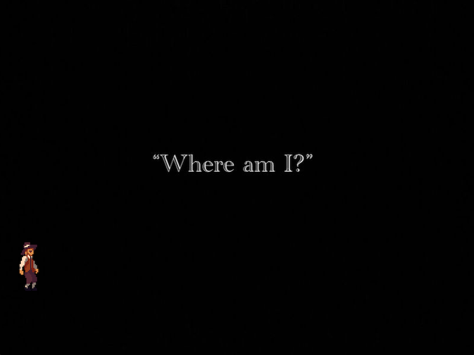
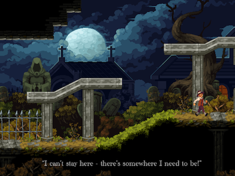
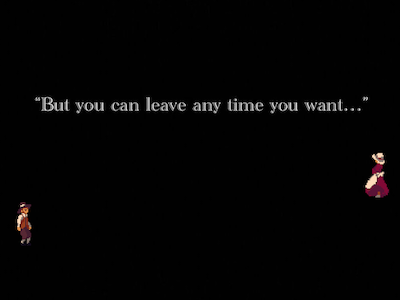
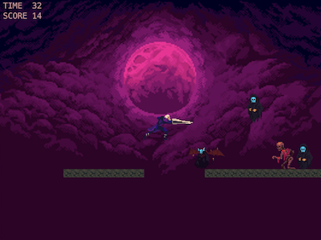
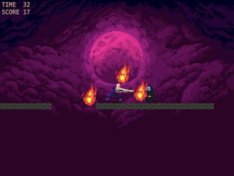
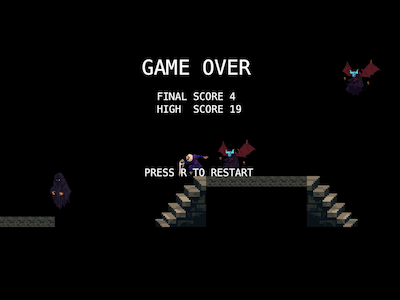

## WhereAmI - Story-Driven 2D Platformer

- Java
- Swing
- JBox2D



- On an eerily chilly night, you awake in a cemetery with no memory of how you got there. A single thought claws at the very fabric of your being: there is somewhere you need to be...
- You attempt to leave the cemetery, only to find you are immediately transported back to the entrance! You try again and again to no avail.
- At the height of your desperation, an angel-like figure descends from the night sky and says that you can leave any time you want. In the blink of an eye, you have been transformed into a grey-haired swordsman with purple armour! 
- Ominously, she declares that she "won't help you anymore". Suddenly, you find yourself transported to a nightmarish world full of demons! How will you survive?


## Installation
- Download only the file entitled "WhereAmI.jar" and the folder entitled "data". Create a new folder and store these as siblings in that folder.

- Open a terminal at the newly created folder. To start the game, type the following:

```
	java -jar WhereAmI.jar
```

**Requirements:**
- Java 17 or above


## Usage
- Press A and D to move left and right
- Press W to jump
- Press S to attack
- Press C to continue during a cutscene
- Press R to restart after a "Game Over"


- The aim of the game is to kill as many demons as you can in 60 seconds
- If you are caught by a demon, if you fall to the spikes below, or if the 60 seconds are over, you will die

## Screenshots







